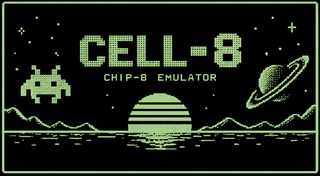
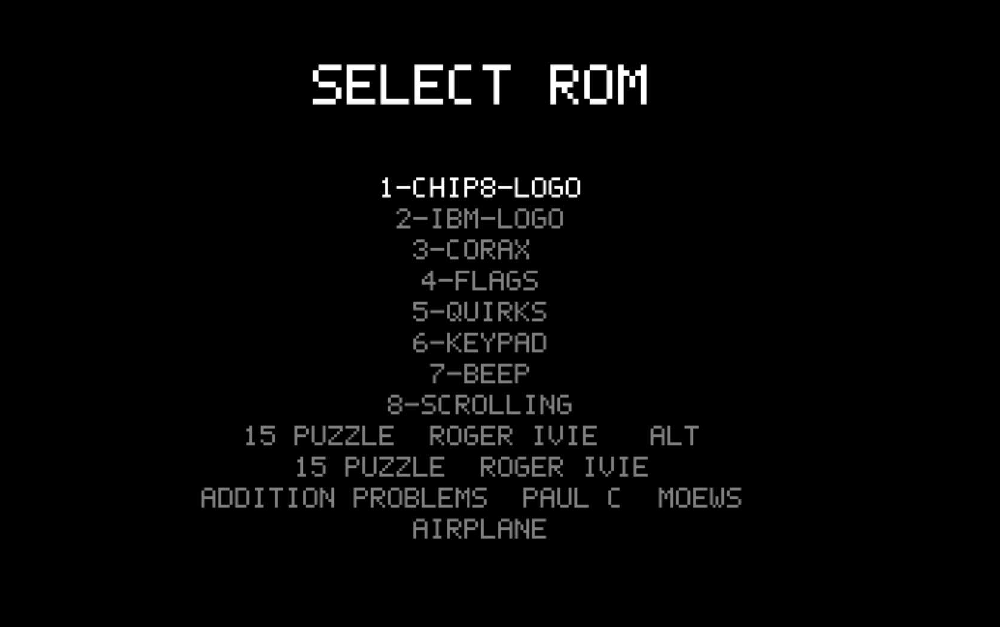
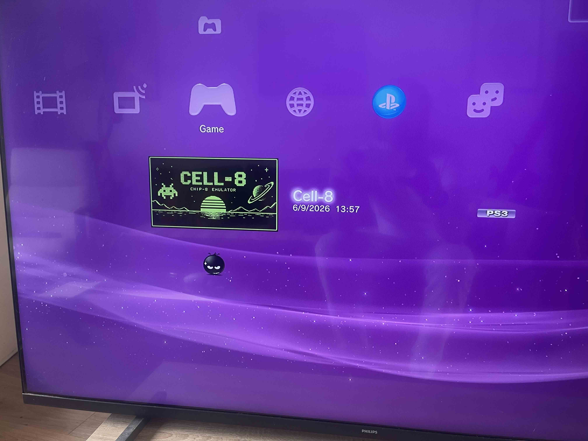
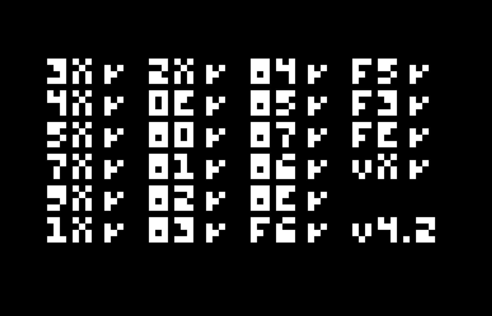
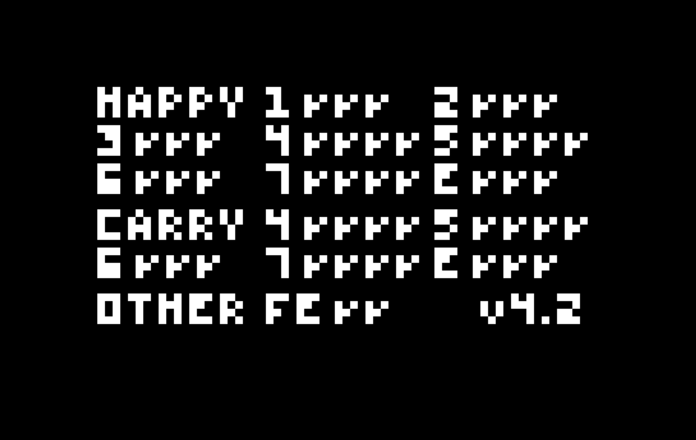

# CELL-8

A CHIP-8 emulator for the PlayStation 3, built from scratch on PSL1GHT, with a hand-rolled bitmap font renderer, DualShock controller input, and a ROM menu that scans your HDD and USB drives for ROMS.

Built upon [ryanradder11/chip8-emulator](https://github.com/ryanradder11/chip8-emulator), a standalone SDL2 CHIP-8 emulator, its interpreter core was ported here as-is onto PS3 hardware.

**[Download the latest release →](https://github.com/ryanradder11/CELL-8/releases/)**

<p align="center"></p>

<p align="center"></p>

<p align="center"></p>

<p align="center">
  
  
</p>
<p align="center"><sub>Both the op-codes & registry flags test ROMs passing on real PS3 hardware.</sub></p>

## Features

- **CHIP-8 interpreter** — full opcode set, ported from [ryanradder11/chip8-emulator](https://github.com/ryanradder11/chip8-emulator) onto raw PS3 hardware.
- **RSX graphics** — the framebuffer is written to directly from the CPU.
- **Custom 5x7 bitmap font** — full A-Z/0-9 renderer used for the title screen and ROM menu, built without any PSL1GHT debug-font dependency.
- **ROM select menu** — D-pad to browse, Cross to launch, SELECT to return to the menu mid-game.
- **Drop-in ROMs** — the emulator scans for `.ch8` files on your HDD and any USB stick at startup.
- **8 bundled test-suite ROMs** — [Timendus' chip8-test-suite](https://github.com/Timendus/chip8-test-suite) ships in the package; used to track down interpreter bugs during development and kept preloaded for further development.

## Controls

| CHIP-8 key | DualShock button |
|:---:|:---:|
| `1` | L1 |
| `2` | Up |
| `3` | R1 |
| `4` | Left |
| `5` | Circle |
| `6` | Right |
| `7` | L2 |
| `8` | Down |
| `9` | R2 |
| `0` | Start |
| `A` | L3 |
| `B` | R3 |

| Action | Button |
|---|---|
| Confirm / start ROM | Cross |
| Navigate menu | D-pad Up/Down |
| Return to ROM menu (mid-game) | Select |

## Adding your own ROMs

Just drop `.ch8` files into one of these folders below and they'll show up in the menu next time Cell-8 starts:

| Location | Path | Notes |
|---|---|---|
| Internal HDD | `/dev_hdd0/game/CELL80001/USRDIR/roms/` | Created automatically on first run if it doesn't exist yet. |
| USB drive | `roms/` folder at the root of the stick | Any port works, CEll-8 checks all 8 possible slots (`/dev_usb000` through `/dev_usb007`). |

## Building from source

Requires the [PSL1GHT](https://github.com/ps3dev/PSL1GHT) SDK and `ps3dev` toolchain (`ppu-gcc`/`ppu-g++`) with `$PSL1GHT` and `$PS3DEV` set.

```sh
make          # builds Cell-8.self
make pkg      # builds an installable Cell-8.pkg
make run      # runs Cell-8.self in RPCS3 (see RPCS3 var in the Makefile)
make clean    # removes all build output
```

## Project structure

```
source/
  main.cpp          entry point: intro screen, ROM menu, game loop, input mapping
  rsxutil.cpp        RSX init, framebuffer setup, flip()
  chip8/             the CHIP-8 interpreter itself
  font/              5x7 bitmap font renderer
  romlist/           HDD/USB ROM directory scanning
roms/                bundled chip8-test-suite ROMs (packaged into USRDIR/roms/)
screenshots/         README images
ICON0.png            PS3 XMB / game-list icon
```

## Credits

- Built upon [ryanradder11/chip8-emulator](https://github.com/ryanradder11/chip8-emulator), its CHIP-8 interpreter core was ported here as-is onto PS3 hardware.
- Many thanks to [Timendus/chip8-test-suite](https://github.com/Timendus/chip8-test-suite), their test ROMs was used throughout development to track down interpreter bugs, and are preloaded with the emulator for further development purposes.
- Built with [PSL1GHT](https://github.com/ps3dev/PSL1GHT).

## Releases

Prebuilt `.pkg` files are published on the [Releases page](https://github.com/ryanradder11/CELL-8/releases/), download the latest one and install it directly in RPCS3 or on a jailbroken PS3, no build step required.

## License

MIT — see [LICENSE](LICENSE).
